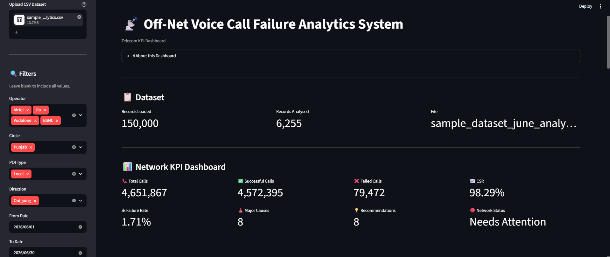

# Off-Net Voice Call Failure Analytics System
A modular telecom analytics project that parses ISUP cause-code datasets,computes call failure KPIs,identifies major failure cause codes and generates rule-based network recommendations.
The C++17 backend performs all analytics while a Python Streamlit dashboard visualizes KPIs, operator performance, trends, and recommendations.

Developed during a Practice School internship at Reliance Jio after the second year of undergraduate studies demonstrating object-oriented C++17, STL-only analytics, and a clean backend-dashboard separation.

---

## Features

• Parse telecom call datasets (.csv)

• Filter records by
  - Operator
  - Circle
  - POI Type
  - Direction
  - Date Range

• Compute
  - Total Calls
  - Successful Calls
  - Failed Calls
  - CSR
  - Failure Rate

• Identify major cause codes above a configurable threshold
• Generate operator-wise statistics
• Generate daily failure trends
• Identifies major trunk group connectivity contributing to failures
• Generate rule-based recommendations using ISUP cause codes
• Interactive Streamlit dashboard
---

## Folder Structure

```
Voice-Call-Failure-Analytics-System/
│
├── CMakeLists.txt               # CMake build configuration
├── requirements.txt             # Python dashboard dependencies
├── .gitignore
├── README.md
│
├── include/                     # C++ headers
│   ├── CallRecord.h
│   ├── DatasetParser.h
│   ├── FilterEngine.h
│   ├── AnalyticsEngine.h
│   └── RecommendationEngine.h
│
├── src/                         # C++ implementation
│   ├── main.cpp
│   ├── DatasetParser.cpp
│   ├── FilterEngine.cpp
│   ├── AnalyticsEngine.cpp
│   └── RecommendationEngine.cpp
│
├── dashboard/
│   └── app.py                   # Streamlit dashboard
│
├── data/                        # Optional sample datasets
├── output/                      # Reserved for future file exports
├── docs/                        # Architecture and design notes
└── tests/                       # Unit test stubs
```

---

## Technologies Used

| Component | Technologies |
|-----------|--------------|
| Programming Language | C++17, Python 3 |
| Backend | STL, Object-Oriented Programming (OOP) |
| Data Parsing | CSV Parser (Custom C++17 STL Parser) |
| Configuration / JSON Support | nlohmann/json |
| Dashboard | Streamlit, Plotly, Pandas |
| Build System | CMake (3.16+) |
| Version Control | Git, GitHub |
---

## Project Architecture

```
CSV Dataset
      │
      ▼
DatasetParser
      │
      ▼
FilterEngine
      │
      ▼
AnalyticsEngine
  ├── KPI Summary
  ├── Cause Code Analysis
  ├── Operator Statistics
  ├── Daily Failure Trends
  └── Major Trunk Group Analysis
      │
      ▼
RecommendationEngine
      │
      ▼
Structured stdout
      │
      ▼
Streamlit Dashboard

## Dashboard Preview





```

**Design principles:**
- All analytics run in the C++ backend; Python only parses stdout and renders charts
- No shared libraries, pybind11, ctypes, or microservices — subprocess stdin/stdout is the only bridge
- Every module communicates through plain structs; no global state
- Cause codes 16–31 are treated as normal outcomes and excluded from all failure KPIs
- Recommendations are generated using configurable thresholds and telecom cause-code rules instead of statistical anomaly detection.

---

## Prerequisites

Windows
• Git
• MSYS2 UCRT64
• GCC 13+
• CMake 3.16+
• Python 3.10+

Linux
• Git
• GCC
• CMake
• Python 3.10+

macOS
• Git
• Clang
• CMake
• Python 3.10+

---

## Build Using CMake

**Clone Repository:**

git clone https://github.com/<username>/Voice-Call-Failure-Analytics-System.git
cd Voice-Call-Failure-Analytics-System

**Windows (MSYS2 + MinGW):**

mkdir build

cd build

cmake .. -G "MinGW Makefiles"

cmake --build .

cd ..

**Linux:**

mkdir build

cd build

cmake ..

cmake --build .

cd ..

**macOS:**

mkdir build

cd build

cmake ..

cmake --build .

cd ..

---

### Backend Binary

After building, the executable is created as:

- **Windows:** `build/vcfas.exe`
- **Linux/macOS:** `build/vcfas`
---

## Running the Backend

The backend reads all inputs interactively from stdin. Run it directly for testing:

```bash
build\vcfas.exe (Windows)
./build/vcfas (Linux/macOS)
```

You will be prompted for:

```
CSV file path:

-- Filters (press Enter to skip) --
Operators (Jio, Airtel, Vodafone, BSNL):
Circles (e.g. Punjab, Haryana, Rajasthan, Uttar Pradesh):
POI Types (e.g. Local, NLD, ILD):
Directions (Incoming, Outgoing):
Date from   DD-MM-YYYY [unbounded]:
Date to     DD-MM-YYYY [unbounded]:

-- Analysis Parameters --
Contribution threshold %  [0.05]:
```
Press **Enter** at any prompt to accept the default. The backend prints a structured summary to stdout covering KPIs, top cause codes, operator statistics, daily failure trend and recommendations.

---

## Running the Streamlit Dashboard

**Prerequisites:** Python 3.10+, and the compiled `build/vcfas` binary.

```bash
# Install Python dependencies
python -m pip install -r requirements.txt
# Run the dashboard
python -m streamlit run dashboard/app.py
```

The dashboard opens in your browser at `http://localhost:8501`.

**Workflow inside the dashboard:**
1. Upload a `.csv` file using the sidebar file uploader
2. Set filters: Operator, Circle, POI Type, Direction, Date Range, Contribution Threshold
4. Click **▶ Run Analysis**

The dashboard pipes all inputs to `build/vcfas` via stdin, parses the structured stdout, and renders:
- KPI metric cards
- Major cause code contribution bar chart
- Daily failure trend line chart
- Operator statistics bar chart and table
- Prioritised NOC recommendation cards

---

## File Schema

The input file must contain a sheet with these column headers (order-independent, case-insensitive, spaces/underscores ignored):

| Column             | Type   | Example                  |
|--------------------|--------|--------------------------|
| Date               | string | 16-06-2026               |
| Operator           | string | Airtel                   |
| Circle             | string | Punjab                   |
| POI_Type           | string | Local                    |
| POI_Name           | string | BHARTI-CHD-LOC-TG        |
| Direction          | string | Outgoing                 |
| Trunk_Group        | string | BHARTI-CHD-LOC-TG-O      |
| Cause_Code         | int    | 34                       |
| Cause_Description  | string | No circuit/channel avail |
| Call_Count         | int    | 19296                    |

Unknown columns are silently ignored. `Circle` is optional.

--- 

## Future Scope

- Deploy backend as REST API
- Docker support
- CI/CD using GitHub Actions
- Authentication for operator dashboards
- Historical KPI comparison
- Add unit tests for each module under `tests/`
- Add a date-wise CSR trend line alongside the failure trend in the dashboard
- Support multi-day dataset aggregation across multiple uploaded files
- Add a configuration file (`.ini` or `.json`) to persist user filter preferences
